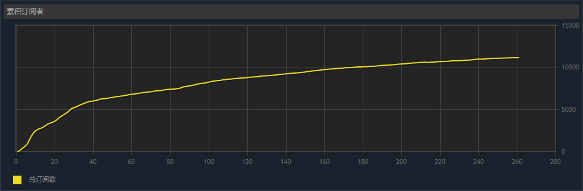

# vpet_modsync

Steam创意工坊（VPet）MOD名称：**模组同步**

虚拟桌宠模拟器模组同步or链接辅助工具，运行此工具将创建软连接（Junction），以达到不需要复制or移动即可让管理器在离线或非Steam启动状态识别到模组的目的！

## 必要性

在有些情况下，比如网络问题，或是很久没运行过，或者一些作者目前还不明确的原因，可能会出现识别不到MOD的情况。

多数应用都有两个MOD目录，一个是本地的，另一个是Steam创意工坊下载的。应用不使用Steam启动时，后者的可能不会被识别和加载，所以有时启动后会发现MOD没有如期加载。比如：

> 刚从Steam创意工坊下载，下一次启动可能由于同步原因、离线原因等，导致MOD未加载，也就使得开机启动的特性失去了部分意义。

**本作者制作的离线工具的旨意在于：确保每次启动时所有MOD都能如期加载，而不是像开盲盒一样启动完了才知道情况。**

## 安装方法

提供两种途径

1. 直接从Steam创意工坊订阅下载。
   
   > Steam创意工坊链接：<https://steamcommunity.com/sharedfiles/filedetails/?id=3032653569>
3. 手动下载，存入`SteamLibrary\steamapps\workshop\content\`或`SteamLibrary\steamapps\workshop\content\1920960`路径下。

   > Github项目地址：<https://github.com/LiuJiewenTT/vpet_modsync>   
   > 对于`v1.0.0`版本，储存在`SteamLibrary\steamapps\common\VPet\mod\`下会导致程序无法正常运行。

## 使用方法

直接打开所在文件夹并运行*vpet_sync.bat*。要断开连接，运行*vpet_sync_break.bat*。
> 定位到文件夹的方法，比如：
> 
> > 在VPet设置页面中，到“MOD管理”选项卡，找到此MOD，点击操作区的“所在文件夹”以打开文件夹。

## 安全

部分安全软件可能会默认拦截或询问是否执行，此处以360举例。

> 作者使用的是360国际版，即360 Total Security。

创建连接是会询问是否允许程序执行。如果你不需要命令行方式或管道通信等特殊用途，建议不要勾选“不再询问”。因为只要勾选了这个选择，不管你是不是选“允许程序所有操作”，**都会使程序本身的执行效率大大下降！**

## 状态

截止至第三次更新（2024年5月25日），收录的合集有 *215* 个，订阅人数已经达到了 *11,130*，好评率为 *98%*，感谢各位朋友的支持！

URL: <https://steamcommunity.com/sharedfiles/filedetails/stats/3032653569>
